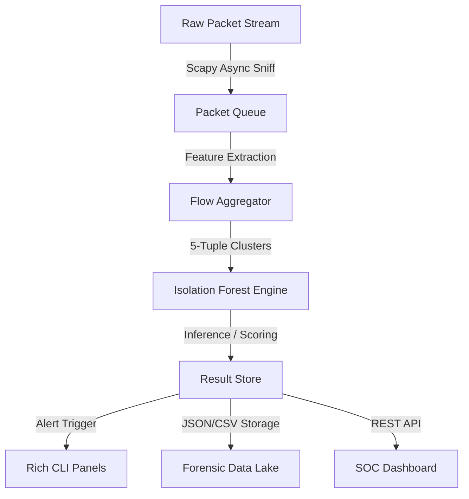

# 🛡️ NetWatch SOC — Advanced AI-Powered Network Security Operations Center

> **Enterprise-grade intrusion detection platform** powered by Machine Learning and Real-time Traffic Forensics.
> **Built with**: Python 3.11+ · Scapy · Scikit-Learn (Isolation Forest) · Flask · Chart.js · Rich CLI

---

## 📈 Platform Overview

NetWatch SOC is a professional network monitoring suite designed to transition from a blind packet capture to an intelligent, multi-layered defense console. It utilizes an unsupervised **Isolation Forest** model to establish behavioral baselines and flag anomalies that deviate from typical network "rhythms."

### Key Features
*   **Controlled Lifecycle**: Secure Standby mode with a pre-start Configuration Modal (Set Interface, Duration, and Sensitivity).
*   **Advanced Analytics**: Real-time System Risk Score (0-100), Network Topology mapping, Flow Lifecycle metrics, and Bandwidth Load tracking.
*   **Forensic Investigation**: Interactive investigation pages for every alert, showing forensic timelines, AI scores, and related flow activity for IP correlation.
*   **Modern SOC UI**: A responsive, dark-mode, glassmorphic layout using professional Navy/Teal color systems and CSS Grid.
*   **Rich CLI Interface**: Polished, color-coded terminal logging with detailed multi-line anomaly panels, suppressing routinely heavy API noise.

---

## 📐 Architecture & Pipeline



1.  **Ingestion**: capture raw packets using Npcap/WinPcap.
2.  **Clustering**: Aggregates overlapping packets into 5-tuple flows (Src IP, Dst IP, Ports, Protocol).
3.  **Calibration**: Learns a baseline of "normal" traffic for a user-defined duration.
4.  **Inference**: Continuously scores new flows. Score < -0.1 = **Anomaly**.
5.  **Investigation**: Users deep-dive into specific incidents via the forensic UI.

---

## ⚙️ Tech Stack

| Layer          | Technology                         |
|----------------|------------------------------------|
| **Core Engine**| Python (Multi-threaded)            |
| **Link Layer** | Scapy + Npcap (Windows Sockets)    |
| **AI/ML Layer**| Isolation Forest (Unsupervised)    |
| **API/Web**    | Flask (Threaded)                   |
| **Frontend**   | Vanilla JS + Chart.js + CSS Grid   |
| **CLI Logging**| Rich Library (Formatted Panels)    |

---

## 🖥️ Prerequisites

1.  **Python 3.11+**
2.  **Npcap** — [https://npcap.com/](https://npcap.com/)  
    *(Install with "WinPcap compatibility mode" enabled for raw socket support)*
3.  **Administrator Privileges** — Required for hardware-level packet sniffing.

---

## 🚀 Deployment

```powershell
# 1. Install SOC Dependencies
pip install -r requirements.txt

# 2. Run with Administrator Privileges
python app.py

# 3. Access the Command Center
# Open http://localhost:5000
```
*Note: Use `python app.py --dev` to enable verbose API logging in the terminal.*

---

## 📡 SOC API Reference

| Endpoint                | Method | Description                                  |
|-------------------------|--------|----------------------------------------------|
| `POST /api/start`       | POST   | Initializes capture with custom config JSON. |
| `GET /api/config`       | GET    | Retrieves current engine parameters.         |
| `GET /api/status`       | GET    | System state (Standby/Calib/Monitoring).     |
| `GET /api/stats`        | GET    | Proto distribution, Top Talkers, Topology.   |
| `GET /api/flows`        | GET    | Latest flow clusters for table view.         |
| `GET /api/alerts`       | GET    | Historical list of detected anomalies.       |
| `GET /api/related_flows/<ip>` | GET | Related activity for specific IP forensics. |

---

## 🧠 Forensic Features

- **Anomaly Score**: A mathematical representation of "difference." Negative scores indicate severe deviation from baseline.
- **IAT (Inter-Arrival Time)**: Analyzes the timing gap between packets to detect non-human/automated heartbeats.
- **Flow Clusters**: Unlike packet-based tools, NetWatch looks at the entire conversation lifecycle.

---

## 📁 Project Structure

```text
├── app.py               # Main Flask Routing & SOC Auth
├── requirements.txt
├── core/
│   ├── logger.py        # Rich CLI Panel formatting
│   ├── sniffer.py       # Async Packet Capturing
│   └── detector.py      # ML Inference & Config Mgmt
├── templates/
│   ├── base.html        # Persistent Sidebar Layout
│   ├── landing.html     # Gateway & Config Modal
│   ├── dashboard.html   # Main Analytics Console
│   ├── anomaly_detail.html # Forensic Deep-Dive
│   ├── settings.html    # Interactive Engine Tuning
│   └── about.html       # Methodology Documentation
├── static/
│   ├── css/style.css    # Professional SOC Theme (Grid)
│   └── js/dashboard.js  # Multi-endpoint Polling & Chart.js
└── data/
    ├── traffic.csv      # Continuous telemetry log
    └── anomalies.json   # Incident storage
```

---

## � Known Issues

- **Tutorial Button Responsiveness**: The Next, Back, and Skip buttons in the demo mode guided tutorial overlay are not responding to clicks. This appears to be a JavaScript event handling issue with inline onclick handlers. Debugging logs have been added to `static/js/onboarding.js` for troubleshooting. The tutorial overlay displays correctly, but navigation is broken.

---

## �💼 Professional Summary

> Developed a full-stack Security Operations Center (SOC) dashboard utilizing Python and Machine Learning to detect network intrusions in real-time. Engineered a non-blocking ingestion pipeline with Scapy and implemented unsupervised anomaly detection using Isolation Forest. Designed a comprehensive forensic investigation suite allowing security analysts to deep-dive into incident telemetry, IP relationships, and behavioral deviations.
